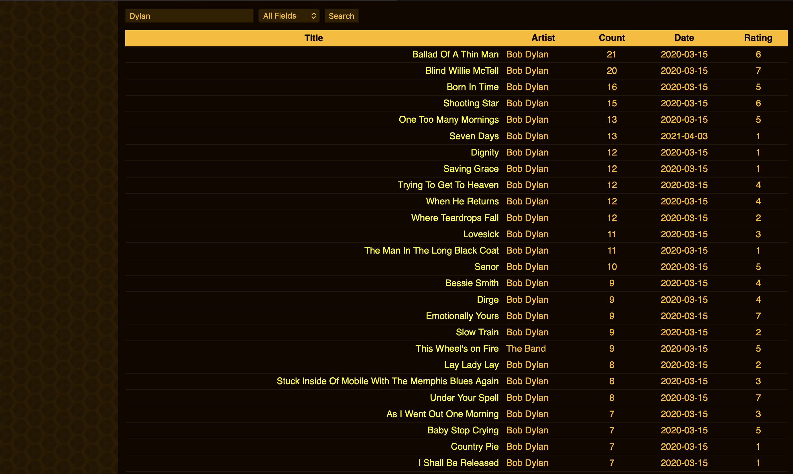
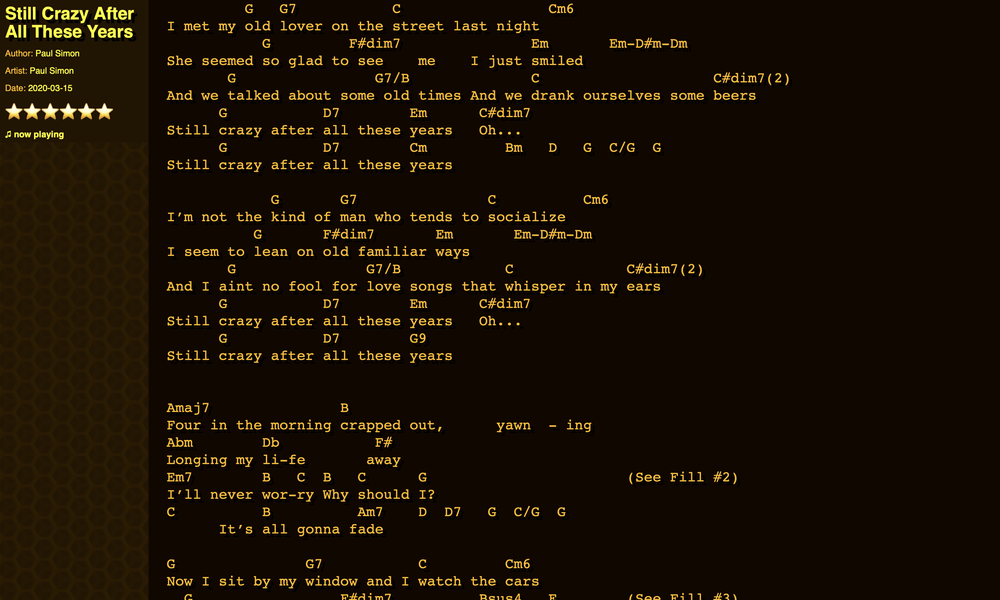
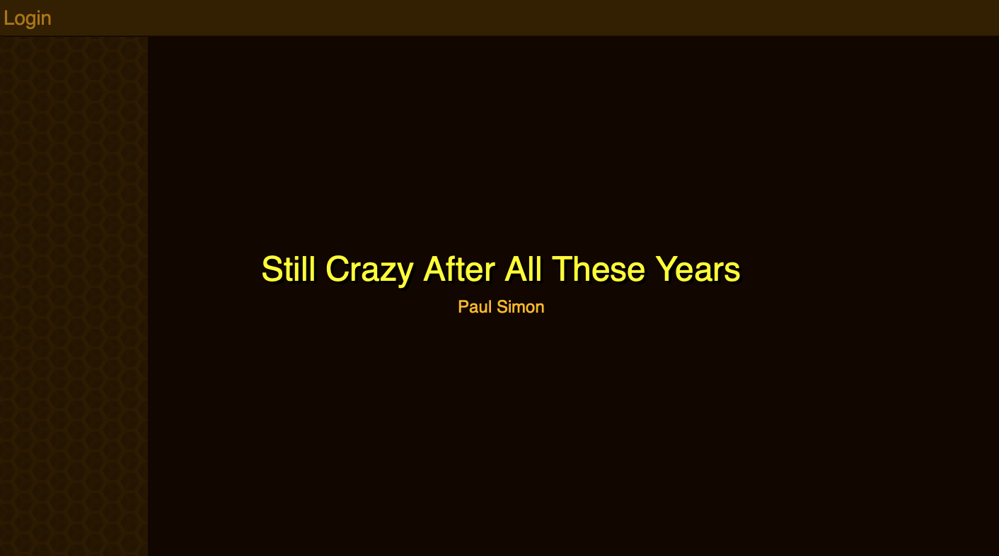

# Chordbook (Codex)

Chordbook is a Flask web app for browsing, searching, and editing fixed-width chord chart text files.
It preserves legacy compatibility with the historical Codex URL and file conventions while providing a modernized Python service layer.

| Song Index | Song View | Now Playing |
|:---:|:---:|
|  |  |  

## Purpose

- Serve a private authenticated music (text files) library.
- Provide quick navigation for moving from song to song.
- Keeps track of "played songs by incrementing a count of songs open for longer than ~DURATION.
- Allows for individual metadata for rating, instrument, tempo, authorship, etc.
- Preserve alignment-sensitive plain text for chord sheets.
- Keep compatibility with legacy entrypoints and metadata format.

## Core Concepts

### Song File Format

Each song file is stored as:

- `chr(1)` (ASCII SOH start-of-heading character)
- JSON metadata header
- `chr(2)` (ASCII SOT start-of-text character)
- raw song body text

The body is rendered as preformatted monospace text so spacing remains intact.

### Metadata

Common metadata fields include title, author, artist, genre, instrument, tempo, rating, and count.
Missing fields are normalized by the library service when files are parsed.

## Main Components

- `app/routes.py`: request dispatch and endpoint handlers.
- `app/services/auth.py`: SQLite-backed authentication and token lookup.
- `app/services/library.py`: song file parsing, header updates, indexing, upload/create/save operations.
- `app/templates/`: Jinja templates for login, index, and view pages.
- `app/static/`: CSS and JavaScript for keyboard-driven UX and in-browser editor flows.
- `wsgi.py` and `index.wsgi`: WSGI entrypoints.

## Route Documentation

### `GET /`

- Shows landing page for anonymous users.
- Redirects authenticated users to index view.

### `GET /login`

- Renders the login page with a "Sign in with Google" button.

### `GET /login/google`

- Initiates the Google OAuth flow.
- Accepts an optional `next` query parameter for post-login redirect.

### `GET /authorize/google`

- Google OAuth callback.
- Finds or creates a user record matched by Google ID or email.
- Sets session and token cookie, then redirects to index (or `next`).

### `GET,POST /index.wsgi`
### `GET,POST /index.php`

Legacy-compatible dispatcher controlled by the `function` query parameter.

#### `function=index`

- Renders searchable/sortable library index.
- Supports filtering by field and query value.

#### `function=view`

- Renders a single song view.
- Supports random selection and filtered random selection.
- Supports new-upload mode with `new=1`.

#### `function=ajax`

JSON endpoints for interactive updates.

Supported `action` values include:

- `setnowplaying`
- `clearnowplaying`
- metadata field updates (for editable fields such as title/genre/instrument/tempo/rating)
- `incrementcount` (time-gated listen count increment)
- `savecontent` (save full song body for existing file)
- `uploadfile` (create a new song file)

#### `function=sse`

- Lightweight event-stream ping endpoint.

#### `function=logout`

- Clears session and token cookie, then redirects to landing page.

## Security and Validation Notes

- Access to index/view/ajax flows requires authentication.
- Filename validation blocks path traversal and control characters.
- Song writes use atomic replace operations.
- Upload/save payload size is capped by configuration.

## Installation and Setup

See [INSTALL.md](INSTALL.md) for local setup, configuration, and run instructions.

## Open Source Governance

- License: [LICENSE](LICENSE) (GNU GPL v3.0 or later)
- Contributing: [CONTRIBUTING.md](CONTRIBUTING.md)
- Code of conduct: [CODE_OF_CONDUCT.md](CODE_OF_CONDUCT.md)
- Security policy: [SECURITY.md](SECURITY.md)
- Changelog: [CHANGELOG.md](CHANGELOG.md)

## Data Redistribution Notice

This project code is open source, but song libraries may have separate copyright restrictions.
Do not publish or redistribute lyric/chord datasets unless you have explicit rights to do so.
